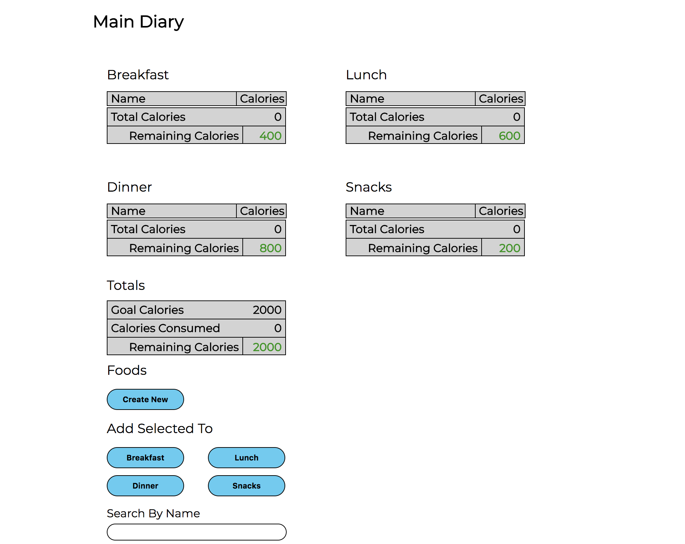
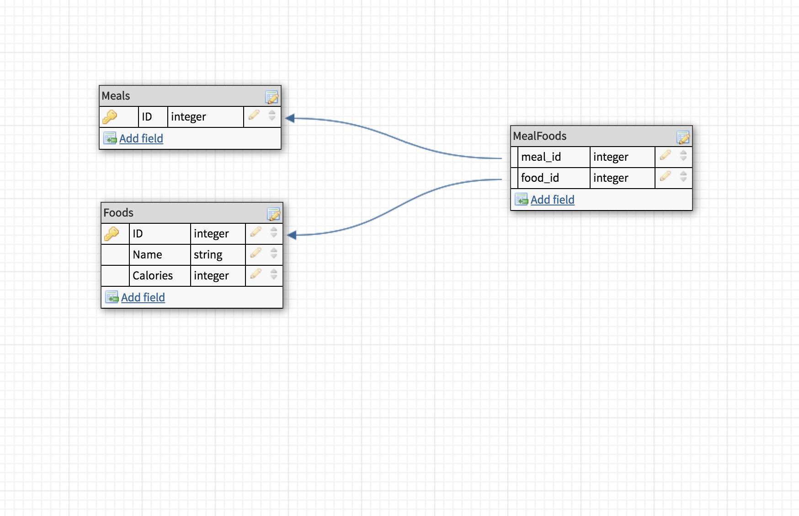

### README

---

# EXPRESS - QUANTIFIED SELF

---

### See The Active Site:
Front End Production Site:<br>
[Quantified Self](https://nergdnvlt.github.io/express_quantified_self_fe/) <br>

API Base URL:<br>
[Quantified Self Express API](https://express-quantified-self.herokuapp.com)<br>

Pitch:
This app is a basic food/meal/calorie tracking application.

Tech Pitch:
This project is an introduction to true Gateway API Architecture. I am utilizing a front-end built in JavaScript which makes fetch calls to the Node.js API endpoints.



---

### Table Of Contents
- [Database and Schema](#database-and-schema)
- [Basic Repo Info](#basic-repo-info)
- [Setup](#setup)
- [API End Points](#api-end-points)
- [Basic Repo Info](#basic-repo-info)
- [Authors](#authors)

---

### Database and Schema

The database is a PostgreSQL database, made up of three tables.
<br>

The first is meals, which is seeded with:
- Breakfast
- Lunch
- Dinner
- Snack
<br>

The second is foods, which each contain a name and amount of calories.
<br>

And the third is MealFoods which is a joins table between meals and foods allowing a food to be a part of many meals and also allowing a meal to have many different foods.


---

## Basic Repo Info:

### Versions/Prerequisites

##### Tech Stack:
To Install and run this application please be aware of the following versions and requirements:
- PostgreSQL 10+
- Express
- JavaScript

### Setup

#### Clone this repository:

  ```
  git clone git@github.com:nergdnvlt/express_quantified_self.git
  ```
  ```
  cd express_quantified_self
  ```

#### Updgrade pip and install dependencies

  ```shell
  npm install
  ```

#### Set up databases using PostgreSQL

  ```shell
  createdb express_quantified_self;
  createdb express_quantified_self_test;
  ```

#### Migrate/Seed

  ```shell
  knex migrate:latest
  knex seed:run
  knex migrate:latest --env test
  knex seed:run --env test
  ```

#### Run test suite

  ```shell
    npm test
  ```

## Run the Server

To see your code in action locally, you need to fire up a development server. Use the command:

```shell
nodemon bin/www
```

Once the server is running, visit API endpoints in your browser:

* `http://localhost:3000/` to run your application.

<br>

---

### API End Points
This is a restful API.

---

## Foods
The food database includes full CRUD functionality at each of it's endpoints.

##### GET REQUESTS
<br>
To get the foods index:

```
GET /api/v1/foods
```

The foods will be returned in as JSON to look like:

```
[
  {
      "id": 1,
      "name": "Apple",
      "calories": 150
  },
  {
      "id": 2,
      "name": "Banana",
      "calories": 75
  },
...
]
```

<br>

To get a single food:

```
GET /api/v1/foods/{food_id}
```

Example:

```
GET /api/v1/foods/1
```

will return a response body of:

```
{
    "id": 1,
    "name": "Apple",
    "calories": 150
}
```

<br>


##### POST REQUESTS
<br>
To create a food item send:

```
POST /api/v1/foods, params: { "food": { "name": "jerky", "calories": "250"} }
```

This will return the food item as JSON
<br>


##### PATCH REQUESTS
<br>
NOTE: To update a food, you MUST pass both the name and calorie amount as parameters.

To update a food:

```
PATCH /api/foods/{food_id}, params: { "food": { "name": "jerky", "calories": "200"} }
```

<br>

##### DELETE REQUESTS

<br>
To delete a food item:

```
DELETE /api/foods/{food_id}
```

It will return a message as JSON about the success of the deletion.


## Meals
Meals has traditional RESTFUL routes for it's index and single meal.

##### GET REQUESTS
<br>
To get the foods index:

```
GET /api/v1/meals
```

The meals will be returned in as JSON to look like:

```
[
  {
      "id": 1,
      "name": "Breakfast",
      "foods": [
          {
              "id": 1,
              "name": "Banana",
              "calories": 150
          },
          {
              "id": 6,
              "name": "Yogurt",
              "calories": 550
          },
          {
              "id": 12,
              "name": "Apple",
              "calories": 220
          }
      ]
  },
  {
      "id": 2,
      "name": "Snack",
      "foods": [
          {
              "id": 1,
              "name": "Banana",
              "calories": 150
          },
          {
              "id": 9,
              "name": "Gum",
              "calories": 50
          },
          {
              "id": 10,
              "name": "Cheese",
              "calories": 400
          }
      ]
  }
]
```

<br>
For the single meal endpoint, per the spec, I wanted to be clear that the foods were the main focus of the meal. So the path emphasizes the forcus on foods.

```
GET /api/v1/meals/{meal_id}/foods
```

## MealFoods

The rest of the API's endpoints are to facilitate associating a food with a meal.

##### POST Requests

```
POST /api/v1/meals/{meal_id}/foods/{food_id}
```

This endpoint will route to the associated action (create) in the MealFoods controller and will create a database row associating the food to the meal. If successful it will return the following message:

```
{
    "message": "Successfully added FOODNAME to MEALNAME"
}
```

##### DELETE Requests

To remove the association between a food and a meal make a delete request:

```
DELETE /api/v1/meals/:meal_id/foods/:id
```

It will return a JSON response of:

```
{
    "message": "Successfully removed FOODNAME to MEALNAME"
}
```

<br>

---

### Authors
- [Tyler Lundgren](https://github.com/nergdnvlt)
